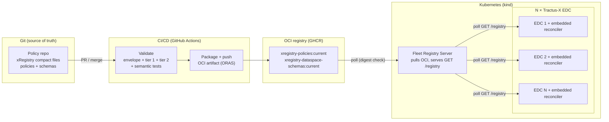

# TAP 7.4 – Pure Reconcile Architecture

| | |
|---|---|
| **Document** | TAP 7.4 – Pure Reconcile: Concept & Technical Specification (TP 1.1 deliverable) |
| **Status** | Draft — for customer review |
| **Version** | 0.1 |
| **Date** | 2026-07-03 |
| **Language** | English |

> **Part II — Technical Specification for the Demonstrator** (Chapters 9–16) is in the companion document `TAP7.4-Pure-Reconcile-Architecture-Part-II-Technical-Specification.md`.

## Table of Contents

- [Management Summary](#management-summary)
- [1 Introduction](#1-introduction)
  - [1.1 Purpose and scope](#11-purpose-and-scope)
  - [1.2 Reading guide](#12-reading-guide)
  - [1.3 Definitions](#13-definitions)
- [2 Review of the Existing Concept](#2-review-of-the-existing-concept)
  - [2.1 Baseline reviewed](#21-baseline-reviewed)
  - [2.2 What carries over unchanged](#22-what-carries-over-unchanged)
  - [2.3 Open design questions resolved by this concept](#23-open-design-questions-resolved-by-this-concept)
  - [2.4 Corrections of prior assumptions](#24-corrections-of-prior-assumptions)
- [3 Target Architecture: Pure Reconcile](#3-target-architecture-pure-reconcile)
  - [3.1 Architecture narrative](#31-architecture-narrative)
  - [3.2 The locked room: operational semantics of Pure Reconcile](#32-the-locked-room-operational-semantics-of-pure-reconcile)
  - [3.3 Scope boundary](#33-scope-boundary)
  - [3.4 Coexistence model: one Management API, two domains](#34-coexistence-model-one-management-api-two-domains)
- [4 Architecture Decisions](#4-architecture-decisions)
  - [AD-01 — Pure reconcile with "reconciler owns and overwrites" lockout semantics](#ad-01--pure-reconcile-with-reconciler-owns-and-overwrites-lockout-semantics)
  - [AD-02 — Reconciler as embedded EDC extension using PolicyDefinitionService](#ad-02--reconciler-as-embedded-edc-extension-using-policydefinitionservice)
  - [AD-03 — Registry server pulls OCI; reconcilers poll plain xRegistry HTTP](#ad-03--registry-server-pulls-oci-reconcilers-poll-plain-xregistry-http)
  - [AD-04 — Eventual consistency, level-based reconciliation](#ad-04--eventual-consistency-level-based-reconciliation)
  - [AD-05 — Policy ID {groupId}/{resourceId}/{versionId}; immutable versions; new version = new PolicyDefinition](#ad-05--policy-id-groupidresourceidversionid-immutable-versions-new-version--new-policydefinition)
  - [AD-06 — Scope boundary: policies + schemas in; assets, contract definitions, runtime state out](#ad-06--scope-boundary-policies--schemas-in-assets-contract-definitions-runtime-state-out)
  - [AD-07 — Version alignment: pin the latest released tractusx-edc; lift Fleet to its upstream EDC version](#ad-07--version-alignment-pin-the-latest-released-tractusx-edc-lift-fleet-to-its-upstream-edc-version)
  - [AD-08 — Deployment: Helm on local kind, Tractus-X umbrella chart as substrate, GitHub Actions + GHCR](#ad-08--deployment-helm-on-local-kind-tractus-x-umbrella-chart-as-substrate-github-actions--ghcr)
  - [AD-09 — Assets and contract definitions exclusively via a MAPI seed script](#ad-09--assets-and-contract-definitions-exclusively-via-a-mapi-seed-script)
  - [AD-10 — Two-tier schema validation at two enforcement points; schemas are versioned registry artifacts](#ad-10--two-tier-schema-validation-at-two-enforcement-points-schemas-are-versioned-registry-artifacts)
  - [AD-11 — Pipeline semantic tests: negative-fixture suite and version-immutability check](#ad-11--pipeline-semantic-tests-negative-fixture-suite-and-version-immutability-check)
- [5 Deviations Register](#5-deviations-register)
- [6 Open Issues](#6-open-issues)
  - [6.1 Purpose and entry format](#61-purpose-and-entry-format)
  - [6.2 P-1 Versioning](#62-p-1-versioning)
  - [6.3 P-2 Precedence / generation gap](#63-p-2-precedence--generation-gap)
  - [6.4 P-3 Runtime lifecycle](#64-p-3-runtime-lifecycle)
  - [6.5 P-4 Schema distribution and versioning (from TP 1.3)](#65-p-4-schema-distribution-and-versioning-from-tp-13)
  - [6.6 P-5 Registry API scalability / pagination](#66-p-5-registry-api-scalability--pagination)
  - [6.7 P-6 Credentials and secrets for OCI access](#67-p-6-credentials-and-secrets-for-oci-access)
  - [6.8 P-7 Policy removal after agreement expiry (workshop action item A8)](#68-p-7-policy-removal-after-agreement-expiry-workshop-action-item-a8)
- [7 Target Environment Selection](#7-target-environment-selection)
  - [7.1 Assessment criteria](#71-assessment-criteria)
  - [7.2 Options](#72-options)
  - [7.3 Recommendation](#73-recommendation)
- [8 Traceability](#8-traceability)
  - [8.1 Decisions and problems → work packages](#81-decisions-and-problems--work-packages)
  - [8.2 Workshop decisions → where honored](#82-workshop-decisions--where-honored)

## Management Summary

This document sharpens the existing TAP 7.4 concept for declarative EDC policy management to the **Pure Reconcile** variant: a Git repository is the single source of truth for policies, a CI/CD pipeline validates and publishes them as OCI artifacts, and every EDC connector in a fleet continuously reconciles its own policy state against that published truth — with no imperative Management API writes to reconciled policies (no mixed operation).

The document delivers everything TP 1.1 requires:

- **Part I (Concept)** reviews the existing concept against the pure GitOps variant, settles seven open design questions through eleven explicit architecture decisions (AD-01…AD-11), records five deviations for customer sign-off — differences from the work packages, corrected workshop assumptions, and documentation-versus-code gaps (D-1…D-5) — and catalogs the open issues (P-1…P-7): the three open concept questions — versioning, precedence (generation gap), and runtime lifecycle — plus four related problems surfaced during the review, each with the simplest solution option that the demonstrator will implement.
- **Part II (Technical Specification)** specifies the demonstrator for TP 1.2–1.4: component inventory, the concrete gap-closure work items in the Fleet codebase (F0–F8), EDC integration, the policy-catalog repository and CI/CD pipeline, the two-tier schema-validation mechanics, eight demo scenarios (S1–S8) mapped to the work packages, the Kubernetes/Helm deployment topology, and the build order with risks.
- **Target environment** (Chapter 7): the assessment concludes that **no cloud deployment is required** to demonstrate any required capability. The recommended target is vendor-neutral Kubernetes, demonstrated on a **local kind cluster with GitHub Actions and GitHub Container Registry**. Of the two named cloud options, **Azure (AKS)** is designated as the cloud target should a cloud deployment be requested later.

Two findings made during this concept phase materially change prior assumptions and deserve the reviewer's attention:

1. **Contract agreements snapshot policies — they do not link to them.** The workshop assumed an agreement references its policy by link, making policy deletion a runtime hazard. Inspection of current Tractus-X EDC shows the opposite: agreements embed a full copy of the policy at negotiation time. Policy deletion is only ever blocked by *contract definitions*, never by agreements. This significantly simplifies the Runtime-Lifecycle problem (→ §2.4, P-3, D-4).
2. **The Tractus-X umbrella chart is a viable deployment substrate.** It ships a working mock identity layer (`ssi-dim-wallet-stub` providing STS, credential service, and BDRS in one pod) and first-class per-connector image/env overrides — which lets the demonstrator run genuine Catena-X credential-checked negotiations without building any identity infrastructure (→ AD-08, §11.2).

---

# Part I — Concept

## 1 Introduction

### 1.1 Purpose and scope

TP 1.1 sharpens the existing TAP 7.4 concept to the pure GitOps variant and hardens the architecture to the point where the demonstrator (TP 1.2) can be built. This document contains:

| TP 1.1 deliverable | Where in this document |
|---|---|
| Review of the existing concept toward the pure GitOps variant (no MAPI/reconcile mixed operation) | Chapter 2 |
| Documented architecture decisions: registry as single source of truth, no parallel MAPI access to reconciled policies, eventual consistency | Chapters 3–4 (AD-01…AD-11) |
| Scope boundary: in-scope (policies, schemas) vs. out-of-scope (assets, contracts, runtime state) | §3.3, AD-06 |
| Problem catalog of open questions (versioning, precedence, runtime lifecycle) with the simplest solution option each | Chapter 6 — Open Issues (P-1…P-7) |
| Technical specification for the demonstrator | Part II (Chapters 9–16) |
| Selection of the target environment (MS Azure or AWS) | Chapter 7 |

This is a **concept for a demonstrator**, not a production architecture. Each decision takes the simplest approach that fully demonstrates the required capability — favouring the fewest moving parts over completeness the demonstrator does not need, while still exercising the real mechanism rather than a stand-in. Where that approach departs from a work-package requirement, corrects a workshop assumption, or diverges from existing documentation, the deviation is recorded in Chapter 5 for explicit customer sign-off.

Per the work-package boundaries, this document performs **no implementation** and **does not resolve** the open concept questions with the upstream EDC team (that is the separate optional TP 2.2); it documents them as structured workshop input.

### 1.2 Reading guide

- **Part I (Chapters 1–8)** is the concept: architecture, decisions, deviations, open issues, environment selection, traceability. It is self-contained on its level of abstraction; wherever it defers implementation shape, it forward-references Part II.
- **Part II (Chapters 9–16)** is the technical specification for the demonstrator: precise enough to derive a project plan for TP 1.2–1.4, including module names, setting keys, API paths, and build order.
- Reviewers pressed for time: read the Management Summary, Chapter 4 (decisions), Chapter 5 (deviations — these need your sign-off), and Chapter 6 (open issues).

### 1.3 Definitions

| Term | Meaning in this document |
|---|---|
| **Pure Reconcile** | Operating mode in which the registry is the *only* source of policy definitions in an EDC. No Management API writes to policies; the reconciler alone owns the policy domain. No mixed MAPI/reconcile operation. |
| **Reconciled domain** | The set of EDC resources owned by the reconciler: policy definitions and validation schemas. Everything else (assets, contract definitions, runtime state) is the *imperative domain*, managed via Management API. |
| **Locked room** | Metaphor for the reconciled domain: in reconcile mode, nobody can durably change it via Management API — the reconciler reverts any drift on the next cycle. |
| **Eventual consistency** | All EDCs converge to the registry state within one reconciliation interval; divergence windows up to that interval are by design. |
| **Level-based reconciliation** | Each cycle compares the full desired state against the full actual state and converges — as opposed to edge/event-based processing of individual changes. This is the Kubernetes/GitOps controller model. |
| **xRegistry** | The [xRegistry.io](https://xregistry.io) metadata model used by Fleet: *groups* contain *resources*, resources contain immutable *versions*. Policies live in `policygroups/…/policies`, schemas in `schemagroups/…/schemas`. |
| **Compact format** | Fleet's file layout for xRegistry content in Git: `policies/[group].[resource].v[version].json` (one file per version). An *expanded* directory format also exists. |
| **OCI artifact** | A tar.gz of the xRegistry file tree pushed to an OCI-compatible registry (media type `application/vnd.dspace.xregistry.v1+1`) via the Fleet Gradle plugin (ORAS). |
| **ORAS** | *OCI Registry As Storage* — an OCI-project tool/SDK for pushing and pulling arbitrary files (not just container images) to and from any OCI-compatible registry. Here it is the transport that stores and retrieves the xRegistry artifact: the pipeline pushes with it, the registry server pulls with it. |
| **Fleet** | The EDC Fleet Registry & Reconciliation codebase (`eclipse-edc/fleet` prototype) this demonstrator builds on: xRegistry model, registry server, reconciler SPI/core/policy, OCI publisher plugin. |
| **Precedence** | Who wins when registry state and EDC state disagree (also called the *generation gap* question). |
| **MAPI** | EDC Management API. |

## 2 Review of the Existing Concept

### 2.1 Baseline reviewed

This concept builds on the results of the prior TAP 7.4 concept workshop, together with the current code bases it will extend. The workshop established the negotiated scope, recorded the workshop decisions (referenced throughout as B1–B6) and action items (A1–A10), and surfaced the three open concept questions (versioning, precedence, runtime lifecycle). Sharpening that material to the pure GitOps variant is the subject of this chapter; the design questions it left open or answered inconsistently are settled in §2.3 and Chapter 4.

The code bases were reviewed for what actually exists today:

| Code base | Reviewed for |
|---|---|
| **[Fleet](https://github.com/eclipse-edc/Fleet)** (prototype on upstream Eclipse EDC 0.12.0) | Implementation base; what the code actually provides vs. what its documentation implies (→ §2.4, §10) |
| **[tractusx-edc](https://github.com/eclipse-tractusx/tractusx-edc)** (current main: TX 0.13.0-SNAPSHOT on upstream EDC 0.17.0) | Target connector; policy SPI behavior, deletion semantics, charts, DCP requirements |
| **[tractus-x-umbrella](https://github.com/eclipse-tractusx/tractus-x-umbrella)** chart (3.15.7, Release 25.12) | Candidate deployment substrate; connector image/env overrides and identity mocking |

### 2.2 What carries over unchanged

The following elements of the prior concept survive the review intact and are adopted as-is:

- The **xRegistry typed model** and its validators in `Fleet/common/xregistry` (well-tested, no changes to the model needed).
- The **compact file layout** `policies/[group].[resource].v[version].json` as the Git authoring format.
- The **OCI packaging pipeline**: Fleet's Gradle plugin (`packageOciArtifact` → `publishOciArtifact` → `buildXRegistryOciPublish`, ORAS-based, tar.gz, media type `application/vnd.dspace.xregistry.v1+1`).
- The **EDC policy ID scheme** `{groupId}/{resourceId}/{versionId}` (e.g. `cx/membership-access/1.0`), distinct from the dotted compact filename.
- The overall **declarative pull model**: no central coordinator, each EDC self-synchronizes, eventual consistency.

### 2.3 Open design questions resolved by this concept

Sharpening the concept to pure GitOps required settling seven design questions that the existing concept had left open or answered inconsistently. Each is resolved by an architecture decision in Chapter 4:

| # | Design question | Work-package / workshop input | Resolved by |
|---|---|---|---|
| C1 | How does the reconciler write policies into the EDC? | Workshop: the locked room implies the Management API is not the write path | **AD-02** |
| C2 | Where does the demonstrator run, and on which OCI registry? | TP 1.2: Helm/Kubernetes-based; registries e.g. GitHub Packages, Harbor | **AD-08** |
| C3 | What validation model applies to policies? | TP 1.3: two-tier (dataspace + company), enforced in CI **and** reconciler | **AD-10** |
| C4 | How many EDCs, and with what state? | TP 1.2: **N** EDCs with identical policy state; acceptance ≥ 2 | **AD-08** |
| C5 | Does the pipeline test meaning, not just schema? | Workshop B3 + TP 1.2: at least one semantic test | **AD-11** |
| C6 | What triggers the GitOps flow? | TP 1.2: a Git repository plus a CI/CD pipeline | **AD-08** |
| C7 | What is the policy-definition identifier format? | — | **AD-05** |

### 2.4 Corrections of prior assumptions

Two assumptions from the workshop do not survive contact with the current code bases:

**(a) Agreements snapshot the policy — the "link" assumption is wrong.** The workshop assumed that a contract agreement references its policy *by link, not copy*, and reasoned from there that deleting a negotiated policy is dangerous or impossible. Current Tractus-X EDC behaves differently:

- A `ContractAgreement` **embeds a full serialized copy** of the ODRL policy at negotiation time. Deleting the originating `PolicyDefinition` afterwards has **no effect** on any existing agreement, and no agreement ever blocks a deletion.
- The only deletion blocker is a **contract definition**: `PolicyDefinitionService.deleteById()` returns a conflict (HTTP 409) if and only if any `ContractDefinition` still references the policy as `accessPolicyId` or `contractPolicyId`.
- Tractus-X additionally provides an explicit **agreement retirement** mechanism (`POST /v3/contractagreements/retirements`) to withdraw data access under an agreement without deleting anything.

This *shrinks* the Runtime-Lifecycle problem: the hard coupling is policy ↔ contract definition, not policy ↔ agreement. The consequences are worked into the open issues (P-3, P-7) and recorded as deviation **D-4**.

**(b) The Fleet prototype is less complete than its documentation implies.** The publish side (Git → OCI plugin → OCI registry) works and is tested. The consume side is a skeleton: the registry server serves hard-coded mock data (no OCI pull, no filesystem load), the reconciler is never scheduled and not even registered for EDC's extension loading, and the policy reconciler's core logic consists of TODOs. Part II (§10) turns this into the precise gap-closure work list F0–F8; the documentation-versus-code gap is recorded as deviation **D-5**.

## 3 Target Architecture: Pure Reconcile

### 3.1 Architecture narrative

The flow, end to end:

1. A policy author changes a policy (or schema) in the **Git repository** — the single source of truth. Published versions are immutable; a change means a new version file.
2. The **CI/CD pipeline** validates every artifact: xRegistry envelope validation, tier-1 (dataspace) and tier-2 (company) content schema validation, and semantic tests. Only artifacts passing all gates are packaged and pushed to the **OCI registry** as a versioned, immutable artifact (plus a moving `current` tag).
3. The **Fleet Registry Server** — one per management domain — polls the OCI registry, pulls new artifact digests, and serves the merged xRegistry document over plain HTTP (`GET /registry`).
4. Each EDC runs the **embedded reconciler extension**. On a fixed interval it fetches the registry document, validates it, and converges its local policy state: create missing policies, update changed ones, delete everything that is no longer in the registry.
5. Assets and contract definitions are created **imperatively via Management API** (a versioned seed script) — deliberately outside the reconciled domain — closing the end-to-end loop: policy → contract definition → contract offer → negotiation → agreement.

### 3.2 The locked room: operational semantics of Pure Reconcile

Reconciled policies must not be manageable via MAPI in parallel. This concept implements that requirement as **convergence, not access control**:

- The registry is the 1:1 truth for the policy domain. On every cycle, the reconciler makes the EDC's policy state equal to the registry state — *whatever* it finds.
- A policy created or modified via MAPI is therefore **reverted within one reconciliation interval**. The Management API technically still accepts the write; the system semantics make it pointless. This is exactly how GitOps controllers (Argo CD, Flux) treat manual `kubectl edit`: drift is detected and corrected, not prevented.
- No MAPI endpoints are disabled. The MAPI must remain fully functional for the imperative domain (assets, contract definitions — workshop decision B2), and selective endpoint blocking would be invasive custom code adding no demonstrated value (→ AD-01, D-2).

The lockout-by-convergence is a **positive demo scene**, not a limitation: manually injecting a rogue policy and watching the fleet revert it demonstrates the "locked room" more convincingly than a 403 response would (→ scenario S8).

### 3.3 Scope boundary

| | In the reconciled domain | Out (imperative / not managed) |
|---|---|---|
| **Policy definitions** | ✔ single source of truth: registry | — |
| **Validation schemas** (tier 1 + tier 2) | ✔ versioned artifacts in registry | — |
| **Assets** | — | ✘ MAPI only (workshop decision B2 — political and technical) |
| **Contract definitions** | — | ✘ MAPI only (needed to close the E2E loop; see the P-3 consequence below) |
| **Agreements, negotiations, transfers** | — | ✘ runtime state — never declarative |
| **EDC configuration, secrets** | — | ✘ Helm/Kubernetes concern |

Two boundary statements from the workshop are restated here as binding:

- **The registry is not the EDC's externalized storage** (decision B5). The EDC keeps its own policy store; the registry is a *synchronization source*, never a database the EDC reads through. It manages only the declarative subset — never runtime state.
- Keeping contract definitions imperative is the simplest choice, but it *creates* a cross-domain coupling: deletion of a reconciled policy can be vetoed by a non-reconciled contract definition. This is named here deliberately and analyzed in problem P-3.

### 3.4 Coexistence model: one Management API, two domains

The demonstrator narrates the MAPI split explicitly:

| Domain | Resources | Write path | Who writes |
|---|---|---|---|
| Reconciled | policies, schemas | Git → pipeline → registry → reconciler | Policy authors via pull request |
| Imperative | assets, contract definitions | Management API | Demo seed script (the only sanctioned MAPI writer) |

The seed script doubles as the proof that the MAPI stays alive and useful next to Pure Reconcile — it is the coexistence model made executable.

## 4 Architecture Decisions

Format: **Decision** · **Rationale** · **Alternatives considered** (with rejection reason) · **Consequences**. Status of all decisions: *proposed — subject to TP 1.1 customer review*. Cross-references: C1–C7 = design questions (§2.3), D-x = deviations (Chapter 5), P-x = open issues (Chapter 6).

### AD-01 — Pure reconcile with "reconciler owns and overwrites" lockout semantics

**Decision.** The registry is the single source of truth for the reconciled domain. The MAPI write-lockout is implemented as *convergence, not access control*: the reconciler unconditionally overwrites or removes any policy state that deviates from the registry, every cycle. No API endpoints are disabled; the lockout is a documented operating convention enforced by convergence.

**Rationale.** Hard-disabling only the policy-write endpoints would require path-level request filtering inside tractusx-edc while keeping the rest of the MAPI alive (assets and contract definitions stay imperative per B2) — invasive custom code for zero additional demonstrated value. Reconciler-owns-and-overwrites is standard GitOps semantics and turns the lockout into a positive demo scene: a manual MAPI policy write is visibly reverted within one cycle ("drift correction", scenario S8).

**Alternatives.** (a) Full MAPI disable — impossible without killing asset/contract-definition management. (b) Selective endpoint disable via an auth/path filter — invasive, fights the standard charts, demonstrates nothing beyond (c). (c) Pure convention without enforcement — unverifiable; the demo could silently run in mixed operation.

**Consequences.** Divergence windows of up to one interval exist by design (AD-04). Edge case: a drifted policy that a contract definition references cannot be *deleted* by the reconciler (deletion guard, 409) — this is not a bug but the entry point of the Runtime-Lifecycle problem (P-3); the reconciler records the conflict and retries. The no-parallel-MAPI requirement is honored in effect, not by technical access denial (→ D-2).

### AD-02 — Reconciler as embedded EDC extension using `PolicyDefinitionService`

**Decision.** The reconciler runs as an EDC extension inside each connector runtime (registered via `META-INF/services`, added to the launcher build) and performs all writes through the injected **`PolicyDefinitionService`** aggregate service — not the raw `PolicyDefinitionStore`.

**Rationale.** Embedded placement resolves C1 in favor of the existing Fleet code direction and avoids an extra deployable per connector. The *service* layer (rather than the bare store) is chosen because it provides, for free, exactly the behaviors TP 1.4 must demonstrate: the **deletion guard** (409 when a contract definition references the policy — this *is* the reconciler-error-handling-for-bound-policies scenario), lifecycle events for observability, and optional Catena-X policy validation. The bare store bypasses all of that, performs no referential checks, and its `create()` is not idempotent.

**Alternatives.** (a) External reconciler calling the MAPI over HTTP — makes the reconciler itself a MAPI writer, contradicting the locked-room narrative; needs auth plumbing; extra deployable. (b) Standalone reconciler with direct database access — grotesque coupling to connector persistence internals. (c) Bare `PolicyDefinitionStore` injection (as in the current Fleet code) — silently bypasses the deletion guard and validation, removing the very signal the TP 1.4 lifecycle scenarios rely on.

**Consequences.** Fleet's `ReconcilerPolicyExtension` migrates from store injection to service injection (a small change to working code). The connector-side Catena-X validation (`edc.policy.validation.enabled`, default `true`) may reject non-conformant policies — the demo policies are authored CX-conformant, and the *pipeline* remains the authoritative gate (AD-10); connector-side validation is defense in depth with a documented off-switch. The reconciler translates service conflicts into reconcile-status reporting instead of exceptions.

### AD-03 — Registry server pulls OCI; reconcilers poll plain xRegistry HTTP

**Decision.** One Fleet Registry Server per management domain pulls the OCI artifacts (ORAS, tar.gz) from the OCI registry, extracts them, and serves the merged xRegistry document over HTTP. The N embedded reconcilers poll that HTTP API (`edc.registry` setting); they never touch the OCI registry directly.

**Rationale.** This puts OCI credentials, pull logic, digest tracking, and archive extraction in exactly one place instead of N connector runtimes, and matches the existing Fleet code shape (registry server + HTTP-polling reconciler already exist as skeletons). Connectors need only an unauthenticated in-cluster HTTP URL.

**Alternatives.** (a) Each reconciler pulls OCI directly — removes one deployment but multiplies the ORAS dependency, registry credentials, and extraction logic into every connector. (b) Shared volume populated by a cron/init job — Kubernetes-specific plumbing with opaque failure modes.

**Consequences.** The registry server is a single point of failure for *freshness* only — not for availability of already-applied state (reconcilers keep the last applied state and retry, → P-2). Its current hard-coded mock store must be replaced by real OCI pull (work item F4). One additional small deployment/chart.

### AD-04 — Eventual consistency, level-based reconciliation

**Decision.** Synchronization is eventually consistent. Reconciliation is level-based: each cycle compares full desired state against full actual state and converges. Sync runs on a periodic, configurable interval (concrete default and demo values in Part II, §10/§15). No cross-EDC ordering or coordination exists.

**Rationale.** Level-based reconciliation makes "new EDC boots → has all policies after its first cycle" and drift-revert (AD-01) fall out of the same mechanism with no extra code.

**Alternatives.** (a) Webhook/push from pipeline to connectors — reintroduces an imperative API surface and fails the new-EDC scenario. (b) Registry-server push to reconcilers — same problem one hop later. (c) Very short interval (5 s) — noisy, masks the eventual-consistency property we want to demonstrate.

**Consequences.** Cross-fleet divergence windows up to one interval per EDC are stated in the demo script and deliberately shown (two EDCs momentarily disagreeing). Bootstrap ordering is trivial: if the registry server is not yet up, a cycle fails gracefully and retries next interval.

### AD-05 — Policy ID `{groupId}/{resourceId}/{versionId}`; immutable versions; new version = new PolicyDefinition

**Decision.** The canonical EDC policy ID is the slash form `{groupId}/{resourceId}/{versionId}` (e.g. `cx/membership-access/1.0`). Published versions are immutable — any change is a new `versionId`. **Every** version present in the registry is materialized as its own `PolicyDefinition` in every EDC; contract definitions reference fully versioned IDs.

**Rationale.** Immutable, version-addressed policies make the TP 1.4 scenario "V1 in active agreements, V2 for new offers" a non-event: both versions exist side by side, nothing is mutated in place, and the reconciler's diff logic reduces to a set difference on IDs plus a content-hash check. Resolves C7.

**Alternatives.** (a) Mutable "latest" policy per resource updated in place — destroys auditability and worsens the precedence problem (P-2). (b) Materializing only the xRegistry default version — breaks the parallel-versions scenario.

**Consequences.** EDC policy count grows with version history until versions are removed from Git (acceptable at demo scale; pruning is an open question in P-1). Contract definitions and demo scripts must always spell the full versioned ID. Git file naming stays the compact convention `policies/[group].[resource].v[version].json` — the dotted filename and the slash ID are different encodings of the same coordinates.

### AD-06 — Scope boundary: policies + schemas in; assets, contract definitions, runtime state out

**Decision.** The reconciled domain contains exactly: policy definitions and the two validation-schema tiers. Explicitly outside: assets (B2), contract definitions, agreements/negotiations/transfers, EDC configuration and secrets — and any notion of the registry as the EDC's externalized storage (B5).

**Rationale.** This is the scope boundary of TP 1.2 (asset lifecycle and declarative asset management are explicitly out of scope) and the workshop decisions verbatim; restating it as a decision with a table (§3.3) prevents future scope-creep discussions.

**Alternatives.** (a) Reconciling contract definitions too — would dissolve the P-3 cross-domain deadlock but is out of scope; noted in P-3 as the structural upstream question. (b) Reconciling assets — rejected by B2.

**Consequences.** The end-to-end demo flow crosses the domain boundary exactly once, via the MAPI seed script (AD-09) — which doubles as the coexistence demonstration (§3.4).

### AD-07 — Version alignment: pin the latest released tractusx-edc; lift Fleet to its upstream EDC version

**Decision.** The demonstrator pins one released tractusx-edc version (placeholder `<txVersion>` = latest stable release at implementation start; the current main is 0.13.0-SNAPSHOT on upstream EDC 0.17.0) and upgrades the Fleet modules' EDC dependency from 0.12.0 to that release's upstream EDC version. Verifying that the reconciler modules compile and their injected services resolve against `<txVersion>` is the **first implementation task** of TP 1.2 (work item F0).

**Rationale.** The five-minor-version gap between Fleet (EDC 0.12.0) and current tractusx-edc is an ABI risk that must be closed on the Fleet side, not by freezing tractusx-edc: the Helm charts, Catena-X validation, and deletion-guard behavior this concept relies on belong to a current TX release. The `PolicyDefinitionStore` / `PolicyDefinitionService` SPI shows no breaking change from 0.12 through 0.16 on inspection, and none is expected for the final step to 0.17; migration cost is therefore expected low — which is precisely what F0 verifies first, by compiling the reconciler modules against `<txVersion>`.

**Alternatives.** (a) Plain upstream EDC without tractusx-edc — loses the Catena-X validation/chart/credential story the demonstrator depends on. (b) Freeze on an old TX matching EDC 0.12 — obsolete charts and known-fixed bugs in a customer demo. (c) Track TX main/SNAPSHOT — non-reproducible demo.

**Consequences.** `<txVersion>` stays a named placeholder in this document and is fixed at implementation start so the concept does not rot.

### AD-08 — Deployment: Helm on local kind, Tractus-X umbrella chart as substrate, GitHub Actions + GHCR

**Decision.** The demonstrator is Helm/Kubernetes-based (TP 1.2) and runs on a **local kind cluster**. The deployment substrate is the **Tractus-X umbrella chart** (data-exchange preset, ingress-less wiring), extended by three demonstrator-owned pieces:

1. a **custom controlplane image** (`edc-demo`, reconciler embedded) injected per participant via the umbrella's first-class override paths `<alias>.dataspace-connector-bundle.tractusx-connector.controlplane.image.*` and `controlplane.env` (for `EDC_REGISTRY`, interval, etc.);
2. the **Fleet Registry Server** as a small separate Helm chart in the same namespace;
3. a values overlay **`values-tap74-reconcile.yaml`** that disables demonstrator-irrelevant baggage (digital-twin registry, submodel server, MAPI test-data seeding), seeds all participant BPNs in the wallet stub, and pre-wires the third participant slot (`dataconsumerTwo`) *disabled* — flipping it on is the "new EDC joins the fleet" scenario.

Git hosting, CI, and OCI registry are one GitHub project: **GitHub Actions** pipelines push xRegistry artifacts to **GHCR**.

**Rationale.** The umbrella ships the one thing every alternative would force us to build: a working DCP identity layer. Its `ssi-dim-wallet-stub` provides STS, OAuth token endpoint, credential service, and BDRS in a single pod and auto-mocks the Catena-X credentials (Membership, FrameworkAgreement/DataExchangeGovernance, BPN, UsagePurpose) for every seeded BPN — so catalog requests, negotiations, and agreements between connectors run with **genuine Catena-X policy evaluation**, which the TP 1.4 lifecycle scenarios require. It uses the official `tractusx-connector` chart per participant with clean image/env override points, is kind-tested in its own CI, and is familiar to the Tractus-X community and the involved teams. GitHub Actions + GHCR satisfy the named registry examples (GitHub Packages, Harbor) with zero additional infrastructure.

**Alternatives.** (a) Custom lightweight demo chart + a vendored mock `IdentityService` (from TX e2e fixtures) — re-invents identity mocking the umbrella already ships and tells a weaker Catena-X story; **kept as the documented fallback** if the umbrella's footprint proves prohibitive on demo hardware. (b) N separate releases of the `tractusx-connector-memory` chart — every release demands the full DCP value block against infrastructure that then still doesn't exist; no substrate. (c) The umbrella's decentralized-IdentityHub preset (real DCP with IssuerService) — namespace-per-connector and manual credential issuance; rejected for the demo, documented as the production-path outlook. (d) A local single-machine stack with a local OCI registry — violates the Helm/Kubernetes requirement. (e) Harbor in-cluster — an entire registry product to operate for a demo.

**Consequences.** Connectors run the postgres+vault flavor of the connector chart (~4 pods per participant, ~15 pods total; documented minimum 4 CPU / 6 GB — acceptable on developer hardware, and postgres persistence makes the demo more production-shaped). Fleet size is bounded to the umbrella's **three pre-aliased participants** — satisfying the "N EDCs" requirement (acceptance: ≥ 2) with a live-demonstrable third join; adding a fourth is a documented values/Chart.yaml procedure, not live-demo material (→ D-3). The umbrella's own MAPI test-data seeding must stay disabled — its seeded policies would be swept by the reconciler on the first cycle (→ §15).

### AD-09 — Assets and contract definitions exclusively via a MAPI seed script

**Decision.** Assets and the contract definitions binding them to reconciled policies are created exclusively through the Management API by a versioned demo seed script. They are never represented in the registry.

**Rationale.** Required by TP 1.2 (assets are created exclusively via MAPI) and workshop decision B2. A versioned script keeps the end-to-end flow reproducible while keeping assets explicitly in the imperative domain.

**Alternatives.** Manual Postman/curl during the demo — irreproducible. Declarative assets — rejected by B2.

**Consequences.** The seed script is the only sanctioned MAPI writer in the demonstrator (§3.4) and must reference fully versioned policy IDs (AD-05).

### AD-10 — Two-tier schema validation at two enforcement points; schemas are versioned registry artifacts

**Decision.** Policies are validated against **Tier 1** (dataspace schema, maintained by the Catena-X association) and **Tier 2** (company schema, e.g. Mercedes-Benz export-control constraints) at two points: the **CI pipeline as the blocking entry gate**, and the **reconciler on load as non-blocking defense in depth** — an invalid resource is skipped, logged, and reported; the last known good state is retained; the reconciler never crashes on bad input. Schemas are themselves versioned artifacts in Git, published to the registry.

**Rationale.** This is TP 1.3 verbatim and resolves C3 against the prior single-tier "governance rules" design. Blocking at the gate while tolerating at the reconciler is the only combination that is both safe (nothing invalid gets published) and available (an artifact/schema mismatch in flight cannot take down policy sync for the whole fleet).

**Alternatives.** (a) Pipeline-only validation — a corrupted or hand-pushed artifact would be applied blindly; TP 1.3 explicitly requires the reconciler validation point. (b) Reconciler-blocking (refuse the whole cycle on any invalid resource) — one bad policy would freeze all policy synchronization.

**Consequences.** Fleet's schema module needs a typed schema-resource model (work item F5/F6); one shared validation library serves both enforcement points (F7). Which schema *version* validates which policy is a genuine open question → P-4.

### AD-11 — Pipeline semantic tests: negative-fixture suite and version-immutability check

**Decision.** Beyond schema validation, the pipeline runs semantic tests (workshop B3; TP 1.2 requires at least one semantic test): (a) a **negative-fixture suite** — a maintained set of deliberately invalid policies that MUST fail validation with the expected violation, proving the gate actually rejects; (b) a **version-immutability check** — a pull request that modifies an existing published version file (instead of adding a new version) fails; plus cheap referential-integrity checks (referenced groups exist, no duplicate IDs).

**Rationale.** Schema validation proves shape; B3 demands proof of *meaning and behavior*. The negative fixtures test the validation chain itself; the immutability check enforces the load-bearing GitOps rule from AD-05 at the earliest possible point. Both are cheap, deterministic, and demonstrably red/green in a live demo (scenarios S3/S4).

**Alternatives.** (a) Regex/JSONPath assertions on constraint presence — semantic in name only; retained as the referential-integrity layer. (b) Spinning up a full EDC in the pipeline for a live policy evaluation — far beyond entry-gate cost; noted as a possible extension, not required.

**Consequences.** The pipeline gains a JVM test stage (Gradle) reusing the Fleet validators and the shared content-validation library (→ §12). Resolves C5.

## 5 Deviations Register

Each row records a genuine difference the customer should confirm at the **TP 1.1 review**: a departure from a work-package requirement, a corrected workshop assumption, or a gap between existing documentation and the actual code base. The register is the sign-off agenda for that review.

| ID | Type | Prior expectation | This concept's position | Why |
|---|---|---|---|---|
| D-1 | Work package — TP 1.1 target-environment choice | Select MS Azure or AWS | Local kind + GitHub Actions + GHCR; **Azure (AKS)** named only as an on-request cloud target | No required capability is cloud-specific; the TP 1.2/1.3 assumptions themselves specify a local test environment / GitHub pipeline (→ Chapter 7) |
| D-2 | Work package — wording "no parallel MAPI access to reconciled policies" | A technical block on Management-API writes | Enforced by convergence — MAPI writes to reconciled policies are reverted on the next cycle, not blocked at the API | The Management API must stay fully available for the imperative domain (assets, contract definitions); a selective block would be invasive for no added value (→ AD-01) |
| D-3 | Work package — TP 1.2 "N EDCs" | An unbounded number of connectors | Fleet size bounded to three pre-aliased participants (acceptance ≥ 2 met, with a live third-EDC join) | The deployment substrate's participants are fixed chart aliases; a fourth+ is a documented procedure, not live-demo material (→ AD-08) |
| D-4 | Workshop assumption | A contract agreement references its policy by link, so deleting a negotiated policy is a runtime hazard | **Corrected:** agreements embed a full policy snapshot; deletion is blocked only by a contract definition; Tractus-X also offers agreement retirement | Verified against current Tractus-X EDC (→ §2.4, P-3) — materially simplifies the runtime-lifecycle problem |
| D-5 | Documentation — Fleet docs | Describe a working reconciler and registry (OCI load, policy apply) | The prototype is a skeleton — stubbed reconciler, mock registry, no OCI pull — which the demonstrator must complete | Established by code review (→ §2.4, work items F0–F8 in §10) |

## 6 Open Issues

### 6.1 Purpose and entry format

This section is the structured problem catalog the concept phase calls for (workshop decision B6): it **documents** the open issues as input for the later workshop with the upstream EDC team (optional TP 2.2); it does not resolve them. Each entry states the open issue, the interim solution the demonstrator implements, and what remains open:

> **Issue** (what is undefined) · **Dimensions / sub-questions** (where they help frame the discussion) · **Simplest solution option — implemented by the demonstrator** (always something the demonstrator actually does) · **Remains open for the upstream workshop**.

### 6.2 P-1 Versioning

**Issue.** A policy exists in at least four version spaces at once — the Git commit, the xRegistry `versionId`, the OCI tag/digest, and (implicitly) the EDC `PolicyDefinition` — and EDC itself has no version concept on policy definitions. How versions are created, activated for new offers, kept in parallel, and retired is undefined upstream; there is no upstream notion of a "compatible" policy change, and the version spaces update at different times (pipeline lag, reconcile lag) for different consumers (contract definitions pin IDs; agreements snapshot content).

**Dimensions.** Version identity (monotonic vN vs. semver) · mutability rules for published versions · how many versions live in an EDC concurrently · who moves offers to a new version, and when · retirement/pruning of superseded versions · role of the xRegistry default-version concept.

**Simplest option (implemented).** AD-05 verbatim: immutable versions; the `versionId` is part of the policy ID; **all** registry versions are materialized in all EDCs; contract definitions pin explicit versions; a new version enters via pull request; an old version lives until its file is deleted from Git. The TP 1.4 parallel-versions scenario (S6) falls out for free.

**Open for workshop.** Compatibility semantics between versions · automated migration of offers to new versions · pruning policy for version history · alignment with xRegistry `defaultversion` semantics.

### 6.3 P-2 Precedence / generation gap

**Issue.** When registry state and EDC state disagree — out-of-band MAPI writes, a partially failed cycle, a Git rollback making the registry *older* than what an EDC already applied, a new EDC joining mid-rollout — which side wins? Does "winning" ever depend on which state is newer?

**Dimensions.** Precedence rule, and whether it is time/generation-aware · behavior when the registry server is unreachable (fail closed vs. keep last known good) · drift detection and reporting · concurrent pipeline runs racing each other · cross-EDC skew visibility.

**Simplest option (implemented).** **Registry always wins, with no generation awareness.** Level-based reconciliation makes every cycle converge idempotently toward the registry — including after rollbacks, which are just another desired state. Registry unreachable → keep the last applied state and retry next cycle (stale-but-available). Drift is reverted and logged; unresolvable conflicts (409) are reported per cycle and retried. No cross-EDC coordination whatsoever. This is a fleet-level rule, not an absolute per-resource invariant: an individual deletion can still be structurally blocked by the deletion guard (→ P-3).

**Open for workshop.** Whether upstream needs generation/epoch markers to detect and refuse "backwards" transitions · drift-alerting standards · a defined behavior contract for registry rollbacks that retroactively contradict live offers.

### 6.4 P-3 Runtime lifecycle

**Issue.** What happens when Git deletes or changes a policy the runtime already uses — referenced by a contract definition, or negotiated into a contract agreement?

> **Correction of a prior assumption (→ §2.4, D-4).** The workshop assumed agreements reference the policy *by link*, so deletion would break or be blocked by agreements. **This is wrong for current Tractus-X EDC:** a contract agreement embeds a **full snapshot** of the ODRL policy at negotiation time. Deleting a policy definition never affects an existing agreement and is never blocked by one. The only deletion blocker is a **contract definition** referencing the policy (`accessPolicyId`/`contractPolicyId` → 409 conflict via the service-layer deletion guard). Tractus-X additionally provides **agreement retirement** (`POST /v3/contractagreements/retirements`) to withdraw data access without deleting anything. The hard coupling is policy ↔ contract definition — not policy ↔ agreement — and that changes what the upstream workshop needs to discuss.

The remaining coupling crosses the scope boundary: deletion of a *reconciled* resource (policy) can be vetoed by a *non-reconciled* one (contract definition, MAPI-owned). The reconciler cannot converge without either violating its scope (deleting the contract definition) or staying permanently in conflict.

**Dimensions.** Desired semantics of deleting a referenced policy · whether contract definitions should become declarative to dissolve the cross-domain deadlock · whether/when agreement retirement belongs in a GitOps flow · effect timing of policy changes on in-flight transfers · operator workflow for resolving 409 conflicts.

**Simplest option (implemented).** The reconciler attempts deletion via `PolicyDefinitionService`; on 409 it records a **reconcile conflict** (policy ID + blocking reason), retries every cycle, and keeps everything else converging. Resolution is a human act: remove or retarget the contract definition via MAPI; the next cycle completes the deletion. Agreements are documented as unaffected-by-design (snapshot semantics); retirement remains a manual MAPI operation outside reconcile scope. This *is* the TP 1.4 reconciler-error-handling-for-bound-policies scenario (S7).

**Open for workshop.** Declarative contract definitions (the structural fix) · a standardized deprecation signal ("no new offers; existing agreements run out") · whether upstream reconcile status reporting should distinguish *delete-blocked* from *delete-failed*.

### 6.5 P-4 Schema distribution and versioning (from TP 1.3)

**Issue.** The dataspace-tier schema is maintained by the association (Verein) and must reach every company pipeline and every reconciler; the company tier evolves independently — two independent publishers, two enforcement points (pipeline, reconciler). Which schema version validates which policy, and what happens to already-published policies when a schema update retroactively invalidates them, is undefined.

**Simplest option (implemented).** Both schema tiers live as versioned artifacts in the demo Git repository and are published to the same OCI registry as **separate artifacts** (the dataspace artifact simulating the association's central registry via its own group/namespace). The pipeline pins schema versions in repo configuration; the reconciler validates against the schema versions currently published in the registry document. Schema-update re-validation is demonstrated by re-running the pipeline (scenario S5) — not by autonomous fleet-wide re-validation.

**Open for workshop.** Real federation with a central association registry · schema compatibility rules (which changes may invalidate existing policies) · reconciler behavior when a schema update invalidates already-applied policies.

### 6.6 P-5 Registry API scalability / pagination

**Issue.** The registry HTTP API returns the entire xRegistry document; pagination and filtering are unimplemented (an explicit TODO in Fleet).

**Simplest option (implemented).** Accept full-document transfer — trivially correct at demo scale (tens of policies).

**Open for workshop.** xRegistry pagination · conditional requests (ETag on artifact digest) · incremental sync for production-scale fleets.

### 6.7 P-6 Credentials and secrets for OCI access

**Issue.** The pipeline needs push rights to the OCI registry; the registry server needs pull rights.

**Simplest option (implemented).** The pipeline pushes with the workflow-scoped `GITHUB_TOKEN` (`packages: write`). For pulls, the recommended happy path is **public GHCR packages ⇒ anonymous pull, zero secrets**; if organization policy forbids public packages, a read-only fine-grained PAT is mounted as a single Kubernetes Secret into the registry server — one secret, one component, a payoff of AD-03.

**Open for workshop.** OIDC / workload-identity federation instead of PATs · artifact signing (cosign) and signature verification in the reconcile path.

### 6.8 P-7 Policy removal after agreement expiry (workshop action item A8)

**Issue.** When may a policy artifact be removed from Git "for good"? The workshop asked: only when no agreement exists at all, or already when no *active* agreement exists?

**Reframed by the snapshot correction (§2.4).** Agreement expiry is technically irrelevant to deletability: agreements never block deletion and keep their embedded policy snapshot forever. The real questions are audit/retention and offer hygiene.

**Simplest option (implemented).** Removal from Git is allowed as soon as no contract definition references the policy. Git history plus immutable, digest-addressed OCI artifacts serve as the audit trail.

**Open for workshop.** Formal retention requirements (legal/compliance view on how long policy definitions must remain reconstructible) and whether Git/registry history satisfies them.

## 7 Target Environment Selection

### 7.1 Assessment criteria

1. **What must the demonstrator prove?** Reconcile semantics, Helm/Kubernetes deployability, N-EDC identical state, pipeline gating. None of these properties is cloud-provider-specific.
2. **What do the work packages say?** TP 1.1 lists MS Azure or AWS as the selection space — but the TP 1.2 and TP 1.3 *assumptions* both state that EDC instances run in a local test environment / GitHub pipeline, and TP 1.2 adds that the demonstration runs on a local development environment. The scope is internally layered: the concept must select; the implementation packages already assume local.
3. **Cost, effort, access.** A cloud target needs a subscription, tenant access, and network approvals from whichever organization provides it — pure schedule risk for zero additional demonstrated capability.
4. **Reproducibility.** Every reviewer should be able to run the demo. A kind cluster plus a GitHub repository is reproducible on any laptop; an AKS subscription is not.

### 7.2 Options

| Criterion | Local kind + GitHub Actions + GHCR | Azure AKS | AWS EKS |
|---|---|---|---|
| Proves required capabilities | ✔ all | ✔ all (nothing additional) | ✔ all (nothing additional) |
| Work-package assumptions (TP 1.2/1.3) | ✔ matches verbatim | ✘ exceeds them | ✘ exceeds them |
| Setup cost / access dependencies | none | subscription, tenant, approvals | account, approvals |
| Reproducibility for reviewers | any laptop | subscription holders only | account holders only |
| Fit for open-source development | ✔ any contributor reproduces it; no paid infrastructure | ~ only where a subscription is provided; not reproducible by arbitrary contributors | ~ same, and no provider identified |

Because the demonstrator is Helm-based (AD-08), **the Kubernetes API is the actual target environment**. AKS or EKS differ from kind only in values overrides (ingress, storage class, image pull secrets) — cloud portability is an architectural property already guaranteed by the design, not something that must be demonstrated by paying for a cluster.

### 7.3 Recommendation

**Selected target environment: Kubernetes (vendor-neutral), demonstrated on a local kind cluster, with GitHub Actions as CI and GHCR as OCI registry.**

Answering the Azure-or-AWS question head-on: of the two named cloud options, **Azure (AKS)** is designated as the cloud target *should a cloud deployment be requested* — it is where a subscription would be made available, so the effort and access hurdles are lowest there; the migration is a values-override exercise either way. The assessment concludes, however, that a cloud deployment is **not required** for any deliverable of TP 1.2–1.4 and is therefore recommended against unless explicitly requested — in which case it is a scope addition. Recorded as deviation **D-1**, converting a potential acceptance ambiguity into an explicit, minuted customer decision at the TP 1.1 review.

## 8 Traceability

### 8.1 Decisions and problems → work packages

| Enables | Contract requirement | Decided/analyzed in |
|---|---|---|
| TP 1.2 | Git repo + CI/CD pipeline (validation, semantic test, OCI push) | AD-08, AD-10, AD-11 |
| TP 1.2 | N EDCs, identical policy state, periodic sync with configurable interval | AD-02, AD-03, AD-04, AD-08 |
| TP 1.2 | New EDC boots → has all policies immediately | AD-04 (level-based), S2 |
| TP 1.2 | Minimal assets via MAPI; E2E policy → contract definition → offer | AD-06, AD-09 |
| TP 1.3 | Two-tier schemas; validation in pipeline + reconciler; schemas as versioned artifacts | AD-10, P-4, F5–F7 |
| TP 1.3 | Demo: invalid policy rejected; schema update re-validation; company-tier violation | AD-10, AD-11, S3–S5 |
| TP 1.4 | New policy version via PR; V1/V2 parallel (V1 in agreements, V2 for offers) | AD-05, P-1, S6 |
| TP 1.4 | Policy bound in contract definition / negotiated in agreement; reconciler error handling | AD-02, P-3, S7 |
| TP 1.4 | Multi-EDC fleet, heterogeneous states | AD-01, AD-04, S8 |

### 8.2 Workshop decisions → where honored

| Workshop decision | Honored in |
|---|---|
| B1 — Demonstrator size S: pure GitOps/reconcile, no mixed operation | AD-01, §3.2 |
| B2 — Assets NOT managed declaratively | AD-06, AD-09 |
| B3 — Pipeline includes schema validation + at least one semantic test | AD-10, AD-11 |
| B4 — Query AP5 Industry Core status before demonstrator build | Out of this document's scope; tracked as project action item |
| B5 — Registry is NOT the EDC's externalized storage | §3.3, AD-06 |
| B6 — Concept questions clarified with upstream team in a later phase | Chapter 6 preamble (open issues are workshop input, not resolution) |
| Locked room — reconciled domain not writable via MAPI in effect | AD-01, §3.2, D-2 |

