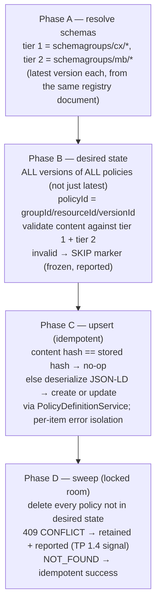

# TAP 7.4 – Pure Reconcile Architecture — Part II

| | |
|---|---|
| **Document** | TAP 7.4 – Pure Reconcile: Concept & Technical Specification (TP 1.1 deliverable) — Part II |
| **Status** | Draft — for customer review |
| **Version** | 0.1 |
| **Date** | 2026-07-03 |
| **Language** | English |

> **Part I — Concept** (Chapters 1–8) is in the companion document `TAP7.4-Pure-Reconcile-Architecture-Part-I-Concept.md`.

## Table of Contents

- [9 Target Architecture, Repositories, Components](#9-target-architecture-repositories-components)
  - [9.1 Repository layout](#91-repository-layout)
  - [9.2 Component inventory](#92-component-inventory)
  - [9.3 End-to-end flow](#93-end-to-end-flow)
- [10 Fleet Gap Closure (work items F0–F8)](#10-fleet-gap-closure-work-items-f0f8)
  - [F0 — Version alignment (prerequisite; serves all TPs)](#f0--version-alignment-prerequisite-serves-all-tps)
  - [F1 — reconciler-spi: visibility fix (TP 1.2)](#f1--reconciler-spi-visibility-fix-tp-12)
  - [F2 — reconciler-core: scheduling + extension registration (TP 1.2)](#f2--reconciler-core-scheduling--extension-registration-tp-12)
  - [F3 — reconciler-policy: full desired-state reconciler (TP 1.2 core, TP 1.3 on-load validation, TP 1.4 error handling — critical path)](#f3--reconciler-policy-full-desired-state-reconciler-tp-12-core-tp-13-on-load-validation-tp-14-error-handling--critical-path)
  - [F4 — New module registry/registry-oci (TP 1.2)](#f4--new-module-registryregistry-oci-tp-12)
  - [F5 — xregistry-schema: typed model (TP 1.3)](#f5--xregistry-schema-typed-model-tp-13)
  - [F6 — New module registry/registry-schema (TP 1.3)](#f6--new-module-registryregistry-schema-tp-13)
  - [F7 — New module common/xregistry/xregistry-content-validation (TP 1.3)](#f7--new-module-commonxregistryxregistry-content-validation-tp-13)
  - [F8 — Fork CI](#f8--fork-ci)
- [11 EDC Integration](#11-edc-integration)
  - [11.1 Runtime assembly — tap74-demonstrator/launchers/edc-demo](#111-runtime-assembly--tap74-demonstratorlaunchersedc-demo)
  - [11.2 Identity / DCP strategy](#112-identity--dcp-strategy)
- [12 Policy Catalog Repository & CI/CD Pipeline](#12-policy-catalog-repository--cicd-pipeline)
  - [12.1 Repository structure (tap74-policy-catalog)](#121-repository-structure-tap74-policy-catalog)
  - [12.2 Pipeline stages](#122-pipeline-stages)
- [13 Two-Tier Schema Validation Mechanics](#13-two-tier-schema-validation-mechanics)
- [14 Demo Scenarios (S1–S8)](#14-demo-scenarios-s1s8)
- [15 Kubernetes / Helm Topology](#15-kubernetes--helm-topology)
- [16 Build Order & Risks](#16-build-order--risks)
  - [16.1 Dependency-ordered build plan](#161-dependency-ordered-build-plan)
  - [16.2 Named risks and mitigations](#162-named-risks-and-mitigations)

---

# Part II — Technical Specification for the Demonstrator

## 9 Target Architecture, Repositories, Components

### 9.1 Repository layout

Three Git repositories. TP 1.2 names a Git repository with example policies and a CI/CD pipeline as a standalone deliverable — the pull-request-triggers-pipeline story is only crisp if the policy repo contains nothing but policies and schemas. Fleet changes live in a Fleet fork because they are candidate upstream contributions.

| Repo | Contents | Publishes |
|---|---|---|
| **Fleet fork**, branch `tap74` (fork of `eclipse-edc/fleet`) | All Fleet gap-closure work items F0–F8 (§10) | Maven artifacts (`reconciler-*`, `xregistry-*`, OCI Gradle plugin) to GitHub Packages Maven; `fleet-registry-server` container image to GHCR |
| **`tap74-policy-catalog`** (new) | xRegistry policy sources, tier-2 company schemas, simulated tier-1 dataspace-schema area, validator CLI, GitHub Actions workflows | Two OCI artifacts to GHCR: `xregistry-policies` and `xregistry-dataspace-schemas` (tags `current` + `v<run>`) |
| **`tap74-demonstrator`** (new) | `edc-demo` launcher module, optional `reconciler-status` extension, umbrella values overlay `values-tap74-reconcile.yaml`, `fleet-registry` Helm chart, kind config, seed scripts, demo script, setup/architecture docs | `edc-demo` container image to GHCR |

Reused externally: **tractusx-edc** `<txVersion>` (Maven Central artifacts + chart) and the **tractus-x-umbrella** chart (deployment substrate).

### 9.2 Component inventory

| Component | Responsibility | New / Modified / Reused | Lives in |
|---|---|---|---|
| `common/xregistry` (model, lib, processor, policy) | Typed xRegistry model, envelope validators, file-system walkers | Reused | Fleet fork |
| `common/xregistry/xregistry-schema` | Schema group definitions + **new** typed schema model (`TypedSchemaResource`/`TypedSchemaVersion`) | Modified (F5) | Fleet fork |
| `common/xregistry/xregistry-content-validation` | Two-tier JSON-Schema validation of ODRL policy content; shared by CI CLI and reconciler | **New** (F7) | Fleet fork |
| `tooling/xregistry-oci-plugin` | Gradle tar.gz packaging + ORAS push | Reused | Fleet fork |
| `registry/registry-oci` | ORAS pull of OCI artifacts, extraction, walker-driven population of reloadable stores, periodic re-pull | **New** (F4) | Fleet fork |
| `registry/registry-schema` | Registers schema group definition + schema store with the registry server | **New**, tiny (F6) | Fleet fork |
| `registry/registry-server` + `registry/launcher` | Serves `GET /registry`; add `POST /registry/reload`; Dockerfile; drop the hard-coded mock store | Modified (F4) | Fleet fork |
| `reconciler/reconciler-spi` | `ResourceReconciler` SPI; `ReconciliationContext` visibility fix | Modified (F1) | Fleet fork |
| `reconciler/reconciler-core` | `ReconciliationManager` scheduling, extension registration, crash guard | Modified (F2) | Fleet fork |
| `reconciler/reconciler-policy` | Full desired-state policy reconciler | Rewritten (F3) | Fleet fork |
| `edc-demo` launcher | tractusx-edc controlplane (postgres/vault flavor) + Fleet reconciler + demo extensions, shadow jar, image | **New** | tap74-demonstrator |
| `reconciler-status` extension | `GET /reconciler/status` exposing the last reconciliation report | **New**, optional | tap74-demonstrator |
| `tools/xr-validator` CLI | Envelope + tier-1/tier-2 content validation + semantic tests, run in CI | **New** | tap74-policy-catalog |
| `fleet-registry` Helm chart | Deploys the registry server | **New** | tap74-demonstrator |
| tractus-x-umbrella (`values-adopter-data-exchange` + overlay) | Connectors, postgres, vault, **`ssi-dim-wallet-stub`** (STS + credential service + BDRS mock) | Reused (config only) | upstream |
| GHCR | OCI registry for xRegistry artifacts and container images | Reused | — |

The inventory deliberately **omits** two things: a separate orchestration service (the GitHub Actions pipeline plus registry OCI polling already cover publish/reload/verify) and a reconciler `compensate()` rollback (a level-based loop is self-healing under eventual consistency; per-item error isolation replaces rollback).

### 9.3 End-to-end flow

1. An author opens a PR in `tap74-policy-catalog` adding a new policy version file, e.g. `src/main/xregistry/policies/cx.usage-framework.2.0.json`.
2. The `validate` workflow runs: envelope validation (Fleet validators, CLIENT mode) → tier-1 dataspace schema → tier-2 company schema → semantic tests (negative fixtures must fail; version-immutability diff check). Any failure = red PR check (TP 1.3 entry gate).
3. On merge to `main`, the `publish` workflow re-validates, then packages and pushes `ghcr.io/<org>/xregistry-policies` twice: immutable tag `v<run-number>` and moving tag `current` (media type `application/vnd.dspace.xregistry.v1+1`). The dataspace-schema artifact is published the same way from its own directory.
4. The Fleet Registry Server re-pulls `current` every `edc.registry.oci.poll.seconds` (manifest-digest short-circuit — no digest change, no work), extracts the tar.gz, walks the compact layout, atomically swaps its in-memory stores, and serves the merged xRegistry document at `GET /registry`.
5. Each of the N connectors runs the embedded reconciler: every `edc.reconciler.interval.seconds` it GETs `edc.registry`, validates the document, re-validates each policy against the tier-1/tier-2 schemas from the same document, then converges its policy store via `PolicyDefinitionService` — create missing, update changed (content hash), sweep-delete everything not in the registry. Conflicts (bound policies) are retained and reported.
6. The operator seeds the imperative domain once via the Management API script: `POST /v3/assets`, `POST /v3/contractdefinitions` referencing reconciled policy IDs such as `cx/membership-access/1.0`.
7. The consumer connector requests `POST /v3/catalog/request` against the provider; the umbrella's wallet stub supplies Membership/BPN/FrameworkAgreement/UsagePurpose credentials, so the Catena-X policy functions evaluate genuinely → the contract offer appears; negotiation produces an agreement (basis of the TP 1.4 lifecycle scenarios).

## 10 Fleet Gap Closure (work items F0–F8)

All items land on the Fleet fork branch `tap74`.

### F0 — Version alignment (prerequisite; serves all TPs)

Bump the Fleet fork's `edc` version in `gradle/libs.versions.toml` from `0.12.0` to the upstream EDC version of the pinned tractusx-edc release `<txVersion>` (currently that would be EDC 0.17.x). Only the modules the demonstrator consumes must build: `common/xregistry/*`, `registry/*`, `reconciler/*`, `tooling/xregistry-oci-plugin`. The reconciler compiles against stable SPIs only (`PolicyDefinitionStore`/`PolicyDefinitionService`, `ServiceExtension`, `Monitor`, `EdcHttpClient`, `TypeManager`, `TransactionContext`) — expected to be a version bump, not a port; F0 verifies exactly that, first. Toolchain: build with the JDK the pinned TX release uses.

**Risk flag.** If `<txVersion>` final is not released at implementation start, pin the latest released TX and its `edc` version instead — same procedure.

### F1 — `reconciler-spi`: visibility fix (TP 1.2)

`ReconciliationContext.getData/setData` are package-private and therefore unusable by reconcilers outside the SPI package. Make both `public`. One-line upstream-contribution candidate.

### F2 — `reconciler-core`: scheduling + extension registration (TP 1.2)

`ReconcilerCoreExtension` currently only provides services; nothing ever runs `ReconciliationManager`. Changes:

- Construct `ReconciliationManager` in `initialize()` (inject `EdcHttpClient`, `TypeManager`, registry, specification, monitor).
- New settings: `edc.reconciler.interval.seconds` (default **60**) and `edc.reconciler.initial.delay.seconds` (default **10**).
- `start()`: single-thread `ScheduledExecutorService` (named `fleet-reconciler`), `scheduleAtFixedRate`. **Wrap `manager.run()` in a catch-all**: `scheduleAtFixedRate` silently cancels the schedule on any uncaught throwable — without the guard, one bad cycle kills reconciliation forever. `shutdown()`: stop the scheduler.
- **Create the missing `META-INF/services/org.eclipse.edc.spi.system.ServiceExtension` files in BOTH `reconciler-core` and `reconciler-policy`** (verified absent) — without them the extensions never load via the ServiceLoader / `shadowJar mergeServiceFiles()` mechanism.
- Pagination stays an accepted TODO (→ P-5); the existing SERVER-mode document validation before dispatch stays.

### F3 — `reconciler-policy`: full desired-state reconciler (TP 1.2 core, TP 1.3 on-load validation, TP 1.4 error handling — **critical path**)

Injection changes in `ReconcilerPolicyExtension`: replace `PolicyDefinitionStore` with **`PolicyDefinitionService`** (AD-02); add `JsonLd` and `TypeTransformerRegistry` (use the `management-api` context); register the schema group definition into `RegistrySpecification` (so SERVER-mode validation accepts documents containing `schemagroups`, → F6). The service manages its own transactions; the outer `TransactionContext` wrapper is dropped (verify during implementation).

Reconcile cycle (level-based, four phases):



Semantics, each a binding spec statement:

- **ID mapping**: `{groupId}/{resourceId}/{versionId}` (AD-05). Every xRegistry version is its own `PolicyDefinition` → V1/V2 parallel is native.
- **JSON-LD deserialization** of the `policydefinition` string attribute follows the exact Management-API ingestion path: parse to a Jakarta `JsonObject` → `jsonLd.expand()` → transform to `PolicyDefinition` via the `management-api` transformer context. Reconciled policies are thereby bit-identical to MAPI-created ones. **Constraint:** `@context` URLs in policy files must be contexts the connector caches locally (the Catena-X and ODRL contexts are); never rely on remote context fetching.
- **Idempotency** via a content hash stored in `privateProperties` (`xregistry:contentHash`, plus `xregistry:xid` and `xregistry:managed=true` for provenance): unchanged cycles produce no writes and no events — essential when N connectors poll every 30 s.
- **Delete-of-absent** = success (NOT_FOUND swallowed).
- **Sweep scope = all policy definitions**, not only reconciler-shaped IDs: a MAPI-created policy is reverted on the next cycle — this *is* the locked-room enforcement (AD-01). A bound rogue policy degrades to "retained + warn", same as a bound registry-removed policy.
- **Invalid-on-load policies are frozen** — neither rewritten nor swept. A schema tightening never destroys running state; it surfaces as a red report entry (→ S5).
- **No `compensate()`**: per-item failures are logged and reported; the next cycle heals.
- Output: a `ReconciliationReport` (created / updated / deleted / retained-bound / invalid / failed) into the `ReconciliationContext` and the monitor log; consumed by the optional status endpoint.

### F4 — New module `registry/registry-oci` (TP 1.2)

OCI pull lives in the registry server (AD-03); reconcilers stay credential-free.

- Settings: `edc.registry.oci.images` (comma-separated list of refs — the policies artifact and the dataspace-schemas artifact), `edc.registry.oci.username`, `edc.registry.oci.password`, `edc.registry.oci.insecure` (default `false`), `edc.registry.oci.poll.seconds` (default `60`; `0` = pull on startup only).
- Classes: `OciRegistryLoaderExtension`; `OciArtifactLoader` (ORAS pull → tar.gz extraction **with path-traversal guard** → compact/expanded walker autodetection); `OciBackedResourceTypeStore<T>` — generic, instantiated for policies *and* schemas, atomic reference swap on reload, write methods throw `UnsupportedOperationException` (the registry is read-only by design — the single-source-of-truth decision stated in code).
- Periodic re-pull with manifest-digest comparison makes the chain fully automatic; `POST /registry/reload` is added to the API controller as the live-demo accelerator.
- Startup resilience: first pull failure → warning, empty store, retry on next poll (no crash loops; matches AD-04 bootstrap semantics).
- `registry/launcher`: add `registry-oci` + `registry-schema` as runtime dependencies, **remove the `registry-policy-memory` mock** (it would shadow real content); add a Dockerfile (temurin JRE, non-root) and a GHCR image workflow.

### F5 — `xregistry-schema`: typed model (TP 1.3)

Add `TypedSchemaResource` / `TypedSchemaVersion` to the module's main sources, mirroring the policy pair (`TypedPolicyResource`/`TypedPolicyVersion`); the version attributes `format`, `schema`, `schemabase64` are already defined in the existing `RegistrySchemaDefinitions`. `getSchema()` returns the JSON Schema document string.

### F6 — New module `registry/registry-schema` (TP 1.3)

Mirror of `registry/registry-policy`: an extension registering the schema group definition with the server's `RegistrySpecification` and a schema store slot (backed by F4's generic OCI store). The same group definition is registered on the reconciler side (F3) so both ends validate documents containing `schemagroups`.

### F7 — New module `common/xregistry/xregistry-content-validation` (TP 1.3)

`PolicyContentValidator`: input = a policy JSON-LD string + an ordered list of (tier name, JSON Schema); output = a violations list. Implementation: a standard JSON Schema validator (draft 2020-12), e.g. `com.networknt:json-schema-validator`. Consumed by the reconciler (F3, Phase B) **and** by the CI CLI (§12) — one implementation, two enforcement points; that identity is the TP 1.3 headline.

**Documented simplification** (feeds P-4): JSON Schema validates the *compacted canonical form* of the policy (fixed `@context`, `odrl:and` array shape). It is shape-based, not graph-based — a semantically identical but differently-shaped JSON-LD document would not match. Authoring rules in the catalog repo enforce the canonical form; the pipeline rejects non-canonical shapes at the envelope stage.

### F8 — Fork CI

GitHub Actions workflow on the Fleet fork publishing the consumed modules and the Gradle plugin to GitHub Packages Maven (version scheme e.g. `<edcVersion>-tap74.<n>`), and the `fleet-registry-server` image to GHCR.

## 11 EDC Integration

### 11.1 Runtime assembly — `tap74-demonstrator/launchers/edc-demo`

A custom launcher module composed from **published** tractusx-edc Maven artifacts — no tractusx-edc fork needed:

```kotlin
dependencies {
    implementation("org.eclipse.tractusx.edc:edc-controlplane-base:<txVersion>")
    // persistence + vault as composed by edc-controlplane-postgresql-hashicorp-vault —
    // the flavor the umbrella's tractusx-connector chart deploys
    implementation("org.eclipse.edc:reconciler-core:<fleetTap74Version>")     // from GitHub Packages
    implementation("org.eclipse.edc:reconciler-policy:<fleetTap74Version>")
    implementation(project(":extensions:reconciler-status"))                  // optional
}
// application main class org.eclipse.edc.boot.system.runtime.BaseRuntime;
// shadowJar with mergeServiceFiles() — recipe copied from the TX launcher build
```

The build script mirrors `edc-controlplane-postgresql-hashicorp-vault`'s composition (SQL stores, migrations, HashiCorp vault) and adds the two Fleet reconciler modules. Extension composition is pure ServiceLoader — the reconciler drops in once F2's `META-INF/services` files exist. One image serves all N connector deployments; it is pushed to GHCR (or into kind's local registry during development, matching the umbrella's own CI pattern).

### 11.2 Identity / DCP strategy

**The umbrella's `ssi-dim-wallet-stub` is the identity layer** (AD-08). One pod provides:

| Endpoint (in-cluster) | Role |
|---|---|
| `/oauth/token` | The STS OAuth token endpoint tractusx-edc requires (`EDC_IAM_STS_OAUTH_TOKEN_URL`) |
| `/api/sts` | DIM-style secure token service |
| `/api` | Credential service (presentation flow) |
| `/api/v1/directory` | BDRS BPN↔DID directory (`TX_EDC_IAM_DCP_BDRS_SERVER_URL`) |

For every BPN listed in `wallet.seeding.bpnList`, the stub auto-generates a `did:web` document and issues the Catena-X credentials (Membership, BpnCredential, DataExchangeGovernance framework credential, UsagePurpose) on demand. Consequences:

- Catalog request, contract negotiation, and agreement creation work cross-connector with **genuine Catena-X policy evaluation** — Membership, BusinessPartnerNumber/Group, FrameworkAgreement, and UsagePurpose constraints are actually enforced by the TX policy functions. This is exactly what the TP 1.4 scenarios need.
- **New-participant onboarding = one BPN appended to `wallet.seeding.bpnList`.** No Keycloak client, no manual issuance, no vault ceremony beyond the chart's own post-start seeding.
- Documented limitation: no real trust chain — identity is explicitly outside the reconcile demonstrator's scope (§3.3).

**Alternatives, documented.** (a) A vendored mock `IdentityService` from the tractusx-edc e2e fixtures — the fallback if the umbrella substrate is ever dropped. (b) The umbrella's decentralized-IdentityHub preset — real DCP with IssuerService and manual credential issuance; the production-path outlook, flagged as a TP 1.4 timebox risk and not the default.

## 12 Policy Catalog Repository & CI/CD Pipeline

### 12.1 Repository structure (`tap74-policy-catalog`)

```
├── src/main/xregistry/                        # company (Mercedes-Benz) tier — compact layout
│   ├── policies/
│   │   ├── cx.membership-access.1.0.json      # access: Membership active + FrameworkAgreement
│   │   ├── cx.bpn-access.1.0.json             # access: BusinessPartnerGroup allowlist
│   │   └── cx.usage-framework.1.0.json        # usage: odrl:and[FrameworkAgreement, UsagePurpose]
│   └── schemas/
│       └── mb.company-policy.1.0.json         # tier-2 JSON Schema (export-control flavored)
├── dataspace/src/main/xregistry/schemas/      # simulated association repo area → own OCI artifact
│   └── cx.dataspace-policy.1.0.json           # tier-1 JSON Schema
├── tests/fixtures/invalid/                    # negative fixtures (semantic-test input)
│   ├── missing-usage-purpose.json             # violates tier 1
│   └── raw-bpn-constraint.json                # violates tier 2
├── tools/xr-validator/                        # thin CLI over Fleet validators + content-validation lib
├── build.gradle.kts                           # xregistry-oci-publisher plugin (2 configs) + validate/semanticTest tasks
└── .github/workflows/
    ├── validate.yml                           # on PR
    ├── publish.yml                            # on push to main
    └── schema-compat.yml                      # on PR touching schemas/ (TP 1.4)
```

- Compact filenames follow the Fleet walker convention `group.resource.version.json`.
- Each policy version file carries the xRegistry version attributes plus `policydefinition` (the stringified Management-API JSON-LD `PolicyDefinition` in canonical compacted form, namespace `https://w3id.org/catenax/2025/9/policy/`) and the `accesspolicy`/`controlpolicy` flags.
- Example policies are authored **CX-profile-conformant** so they pass connector-side validation: access policies restrict themselves to the permitted left operands (Membership, BusinessPartnerGroup, FrameworkAgreement, inForceDate); the usage policy carries the mandatory `FrameworkAgreement` **and** `UsagePurpose` constraints under `odrl:and`.
- The tier-2 company schema (export-control flavored, the TP 1.3 example): `UsagePurpose` values must come from an approved enumeration; raw `BusinessPartnerNumber` left operands are forbidden (must use `BusinessPartnerGroup`); the `FrameworkAgreement` version is pinned.

### 12.2 Pipeline stages

**`validate.yml` (on pull request):**

1. `./gradlew validateXRegistry` — envelope validation of every file (Fleet validators, CLIENT mode) + tier-1 + tier-2 content validation via the shared library (F7). Tier-1 schema source: the file under `dataspace/` at HEAD — documented stand-in for pulling the association's published OCI artifact (→ P-4).
2. `./gradlew semanticTest` — the two semantic tests of AD-11: (a) every file in `tests/fixtures/invalid/` MUST fail validation with the expected violation code; (b) version-immutability: a diff against the PR base that *modifies* an existing `policies/*.json` version file fails the build — published versions are immutable, changes require a new version file.

**`publish.yml` (on push to `main`):** re-validate → `packageOciArtifact` → `publishOciArtifact`, invoked twice per artifact (`-PociArtifactTag=v${{ github.run_number }}`, then `-PociArtifactTag=current`); authenticated with the workflow `GITHUB_TOKEN` (`packages: write`). Publishes `xregistry-policies` (policies + tier-2 schemas) and, from the `dataspace/` directory with its own plugin configuration, `xregistry-dataspace-schemas`.

**`schema-compat.yml` (on PR touching `schemas/`; TP 1.4):** minimal compatibility rule set comparing a new schema version against its predecessor — **exactly two rules**: (1) added `required` members ⇒ breaking; (2) shrunk `enum` ⇒ breaking. Breaking ⇒ demand a major version bump, else warn. *Timebox guard: no further rules in TP 1.4.*

## 13 Two-Tier Schema Validation Mechanics

| Aspect | Design |
|---|---|
| Representation | JSON Schema (draft 2020-12) documents carried as xRegistry schema resources (`schemagroups` → `schemas`; version attribute `schema` = inline schema string, `format` = `JsonSchema/2020-12`). Schemas are first-class versioned artifacts, as TP 1.3 requires |
| Tier assignment | By schema group: `schemagroups/cx/*` = tier 1 (dataspace/association), `schemagroups/mb/*` = tier 2 (company). Convention documented here; richer binding (labels/selectors) is a P-4 workshop topic |
| What is validated | **Policy content** — the ODRL JSON-LD inside `policydefinition` — as distinct from the xRegistry *envelope* validation the Fleet validators perform. Both run at both enforcement points |
| Enforcement point 1 — CI (blocking entry gate) | `tools/xr-validator` in the catalog repo: Fleet envelope validators + shared content-validation library (F7). Only doubly-valid policies reach GHCR |
| Enforcement point 2 — Reconciler (non-blocking, on load) | Reconciler Phase A/B (F3): resolves the current tier-1/tier-2 schemas from the same registry document and validates each policy before any store write. Invalid ⇒ skipped, frozen, reported |
| Distribution & versioning | Two OCI artifacts in the same GHCR namespace: `xregistry-dataspace-schemas` (association-owned in production) and `xregistry-policies` (company-owned, includes tier-2 schemas). The registry server pulls both (`edc.registry.oci.images`) and serves one merged document. Schema versions are immutable; a schema update = new version file = new artifact publish |
| Third gate (bonus, connector-native) | tractusx-edc's own policy-definition validation via `edc.policy.validation.enabled=true` inside `PolicyDefinitionService` — "the EDC validates, too." Documented off-switch per connector if JSON-LD shape friction appears |

## 14 Demo Scenarios (S1–S8)

| # | TP | Scenario | Preconditions | Steps | Expected observable outcome |
|---|----|----|----|----|----|
| S1 | 1.2 | Policy add/change → auto-sync | Stack running, pipeline green | PR adds `cx.pcf-use.1.0.json`; merge | Workflow green → GHCR `current` digest moves → within poll + interval, all N connectors show the policy via `GET /v3/policydefinitions` with identical content |
| S2 | 1.2 | New EDC joins the fleet | ≥ 1 policy in registry | `helm upgrade` flipping `dataconsumerTwo.enabled=true` (BPN pre-seeded in the wallet stub) | New connector converges on its **first** reconcile cycle — no manual step, no replay |
| S3 | 1.3 | Invalid policy → pipeline rejects (tier 1) | — | PR with a policy missing the mandatory `UsagePurpose` constraint | Red PR check citing the tier-1 violation; nothing published |
| S4 | 1.3 | Company-schema violation (tier 2) | Policy passes tier 1 | PR with a raw `BusinessPartnerNumber` constraint | Red PR check citing the tier-2 (company) violation — demonstrates tier independence |
| S5 | 1.3/1.4 | Schema update → re-validation + compatibility check | Policies synced | PR publishes `mb.company-policy.2.0` tightening the purpose enum; one existing policy becomes non-compliant | `schema-compat.yml` flags the breaking change (major bump demanded); after publish, the reconciler report marks the existing policy invalid-on-load → **frozen, not deleted**; visible in logs / status endpoint |
| S6 | 1.4 | New version via PR; V1/V2 in parallel | V1 negotiated into an agreement (via wallet-stub credentials) | PR adds `cx.usage-framework.2.0`; merge; seed script adds a contract definition referencing `…/2.0` | Both `…/1.0` and `…/2.0` exist in every connector; the old agreement (snapshot) is untouched; new offers carry V2 |
| S7 | 1.4 | Bound-policy deletion attempt + agreement immutability | `…/1.0` referenced by a contract definition and inside an agreement | Remove the V1 file from Git; merge | Sweep delete → 409 conflict → policy **retained**, report warns "retained: bound by contract definition"; after the contract definition is deleted via MAPI, the next cycle garbage-collects the policy; the agreement remains readable with its embedded snapshot |
| S8 | 1.4 | Heterogeneous multi-EDC states | 3 connectors | (a) scale one connector to 0 during S1, restart later; (b) `POST /v3/policydefinitions` a rogue policy on one connector | (a) the restarted connector converges to the identical state after downtime; (b) the rogue policy disappears on the next cycle — the locked room demonstrated live |

**30-minute demo script order:** S1 → S2 → S3 → S4 → S8b → S6 → S7 (S5 as the extended-session extra). The eventual-consistency window (two connectors briefly disagreeing during S1) is narrated, not hidden.

## 15 Kubernetes / Helm Topology

- **Cluster:** kind (config file committed to `tap74-demonstrator`; the same config drives a GitHub Actions install smoke test). Windows workstations run kind under Docker Desktop/WSL2 — the umbrella documents Windows support as partial, so WSL2 is the supported path.
- **Namespace:** `tap74`. Two Helm installs:

**(a) tractus-x-umbrella** with `values-adopter-data-exchange.yaml` + the demonstrator overlay `values-tap74-reconcile.yaml`:

| Override | Value / purpose |
|---|---|
| `<alias>.dataspace-connector-bundle.tractusx-connector.controlplane.image.repository/tag` | the `edc-demo` image (reconciler embedded), per participant |
| `<alias>…controlplane.env.EDC_REGISTRY` | `http://tap74-registry:8181/registry` |
| `<alias>…controlplane.env.EDC_RECONCILER_INTERVAL_SECONDS` | `30` (demo value; code default 60, AD-04) |
| `<alias>…controlplane.env.EDC_POLICY_VALIDATION_ENABLED` | `true` (third gate, §13) |
| `identity-and-trust-bundle.ssi-dim-wallet-stub.wallet.seeding.bpnList` | all three participant BPNs (incl. the initially disabled third) |
| `tx-data-provider.digital-twin-bundle.enabled` / `…data-persistence-layer-bundle.enabled` | `false` — demonstrator-irrelevant baggage |
| `tx-data-provider.seedTestdata` | `false` — **required**: the umbrella's seeded MAPI policies would be swept by the reconciler on the first cycle; assets/contract definitions come from the demonstrator's own seed script instead (AD-09) |
| `dataconsumerTwo.enabled` | `false` initially — flipping to `true` is scenario S2 |
| URL wiring | in-cluster ClusterIP service names throughout (pattern of the umbrella's CI preset `values-test-data-exchange.yaml`) — no ingress, no `*.tx.test` host-file entries |

**(b) `fleet-registry` chart** (from `tap74-demonstrator`): one Deployment + Service (port 8181), env from values: `EDC_REGISTRY_OCI_IMAGES` (both artifact refs), `EDC_REGISTRY_OCI_POLL_SECONDS=60`, optional credentials from Secret `oci-registry-creds`; liveness/readiness probes on `GET /registry`. *(The exact URL path served — `/registry` under the configured web context — is confirmed against the launcher's web configuration at implementation; both sides are plain settings.)*

- **Secrets:** happy path = **public GHCR packages ⇒ anonymous pulls, zero secrets** (subject to org policy). Otherwise: `oci-registry-creds` (read-only fine-grained PAT) for the registry server and standard `imagePullSecrets` for images.
- **Seeding:** `scripts/seed-assets.sh` (curl against `/v3/assets`, `/v3/contractdefinitions`, then `/v3/catalog/request` from the consumer) — a deliberate, narrated manual step, not a Helm hook: assets are imperative by decision (AD-09).

## 16 Build Order & Risks

### 16.1 Dependency-ordered build plan

| Phase | Work | Ordering | Produces |
|---|---|---|---|
| **P0** | Fleet fork bootstrap: F0 version bump + F8 publish plumbing | Blocks all Fleet consumers | — |
| **P1** | Reconciler completion: F1 → F2 → F3 (F3 is developable against a static `/registry` JSON served by any HTTP stub — no dependency on P2) | Blocks every runtime scenario | — |
| **P2** | Registry supply chain: F4 `registry-oci` + launcher image | Parallel to P1, after P0 | — |
| **P3** | Demo runtime: `edc-demo` image + umbrella overlay values + `fleet-registry` chart on kind, 2 connectors | Depends on P1 + P2 | TP 1.2 happy path, end to end (S1; S2 via the third slot) |
| **P4** | policy-catalog repo + `validate`/`publish` workflows | Structure parallel to P1; publish needs the plugin from P0 | — |
| **P5** | TP 1.3: F5 + F6 + F7, CLI tiers in CI, reconciler on-load validation, schema artifacts | — | S3–S5 |
| **P6** | TP 1.4 (30-PT timebox, work-to-budget; contents agreed with the customer before implementation) | — | S6–S8 (priority order below) |

Within the P6 timebox, in priority order:

1. **S6 versioning** — mostly free (F3 already reconciles all versions).
2. **S7 bound-policy lifecycle** — free via the service-layer deletion guard.
3. **S8 heterogeneous fleet** — values + script work only.
4. **reconciler-status endpoint** — recommended early (observability for all scenarios).
5. **schema-compat workflow** — first candidate to cut.
6. **scenario-catalog document + extended docs** — fixed cost, protect it.

**Critical path: P0 → P1 (F3) → P3.**

### 16.2 Named risks and mitigations

| Risk | Mitigation |
|---|---|
| JSON-LD transform edge cases in F3 (policy deserialization) | Canonical authoring rules in the catalog repo; only connector-cached `@context` URLs; documented off-switch `edc.policy.validation.enabled=false` per connector |
| `<txVersion>` release timing; umbrella chart-pin discrepancy (the umbrella's connector bundle pins an older released chart while supporting local chart wiring) | Pin-latest-released procedure in F0; the demonstrator pins **one** released tractusx-edc chart+runtime version and documents it |
| Umbrella resource footprint on demo laptops (documented minimum 4 CPU / 6 GB; ~15 pods) | Trim provider baggage (§15); fallback: a custom lightweight chart + vendored identity mock |
| Windows workstation support for the umbrella is partial | kind under Docker Desktop/WSL2 as the supported path; CI smoke test on Linux runners |
| `schema-compat.yml` scope creep in the TP 1.4 timebox | Hard two-rule limit (§12.2); anything more is a workshop topic (P-4) |
| GHCR organization policy may forbid public packages | Secret-based auth path fully specified (§15); one secret, one component (AD-03) |
| Fleet fork drift vs. upstream `eclipse-edc/fleet` | All F-items are minimal and upstream-shaped (F1 is a one-liner); fork lives on a dedicated branch with upstream contribution as the declared intent |
